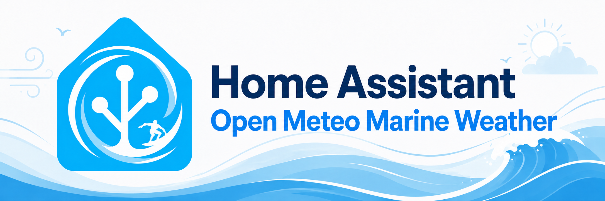

# Open-Meteo Marine Weather

> *Generated by [aurora@aurora-smart-home (ha-integration-dev skill)](https://github.com/tonylofgren/aurora-smart-home)*

Home Assistant integration for marine weather conditions from the free
[Open-Meteo Marine Weather API](https://open-meteo.com/en/docs/marine-weather-api).
No API key required.

## What this does

Adds one device per configured location, each exposing marine measurements as
individual sensor entities:

| Sensor | Unit |
|--------|------|
| Wave height | m |
| Wave direction | ° (plus a compass-name sensor) |
| Wave period | s |
| Wave peak period | s |
| Swell wave height | m |
| Swell wave direction | ° (plus a compass-name sensor) |
| Swell wave period | s |
| Swell wave peak period | s |
| Secondary swell wave height | m |
| Secondary swell wave direction | ° (plus a compass-name sensor) |
| Secondary swell wave period | s |
| Tertiary swell wave height | m |
| Tertiary swell wave direction | ° (plus a compass-name sensor) |
| Tertiary swell wave period | s |
| Wind wave height | m |
| Wind wave direction | ° |
| Wind wave period | s |
| Wind wave peak period | s |
| Sea level height | m |
| Sea surface temperature | °C |
| Ocean current velocity | km/h |
| Ocean current direction | ° (plus a compass-name sensor) |
| Invert barometer height | m |

All sensors for a location share a single `DataUpdateCoordinator` that polls
Open-Meteo every 30 minutes, so adding more locations does not multiply the
number of API calls per location beyond one request each.

### API variables at a glance

Each poll makes **one HTTP request** to the
[Marine Weather API](https://open-meteo.com/en/docs/marine-weather-api)
(`https://marine-api.open-meteo.com/v1/marine`), asking for all three of the
API's variable groups at once:

| Open-Meteo parameter | What it returns | Feeds |
|---|---|---|
| `current` | One live reading per variable, e.g. `wave_height` | The sensor's **state** |
| `daily` | 7-day max/dominant values, e.g. `wave_height_max` | The sensor's `forecast` attribute |
| `hourly` | Next 24 hours, same variable names as `current`, e.g. `wave_height` | The sensor's `hourly_forecast` attribute |

Worked example for wave height — three API fields, one sensor:
- `current.wave_height` → state of `sensor.<name>_wave_height`
- `daily.wave_height_max` → `forecast` attribute (one entry per day)
- `hourly.wave_height` → `hourly_forecast` attribute (one entry per hour)

Not every variable is published in all three groups upstream:

- **Wave, swell, and wind-wave height/direction/period** (11 sensors) get all
  three — state, `forecast`, and `hourly_forecast`.
- **Peak periods, secondary/tertiary swell, sea level, sea surface
  temperature, ocean current, and invert barometer height** have no daily
  max/dominant field in the API, so those sensors get state and
  `hourly_forecast` only — no `forecast` attribute.
- **Compass-name sensors** (e.g. `wave_direction_name`) are derived locally
  from another sensor's current reading, not fetched from the API directly —
  they have no `forecast` or `hourly_forecast` attribute of their own.

See the code: `const.py` defines `CURRENT_VARIABLES`, `DAILY_VARIABLES`, and
`HOURLY_VARIABLES`; `coordinator.py` builds the request from them; `sensor.py`
maps each Open-Meteo field to a sensor via `daily_key`/`hourly_key` on each
`MarineSensorDescription`.

### Surf quality entities

Two additional entities are created automatically for every location — they
are always added and are not part of the sensor-picker checkbox described
below, since they're a derived feature rather than a raw Open-Meteo variable:

| Entity | What it shows |
|--------|---------------|
| **Surf rating** sensor (`sensor.<name>_surf_rating`) | A one-word read of current conditions — `Poor`, `Fair`, `Good`, or `Epic` — computed from wave height, swell period, and how much wind-driven chop is mixed into the swell. Attributes: `score` (the underlying 0–100 number behind the rating) and `next_good_window` (the next 3 upcoming hours in the next 24 that actually meet your thresholds, each with a datetime, rating, and score — empty when none do) — use this to answer "when's it worth going down?" without reading the raw hourly forecast yourself. |
| **Good surf** binary sensor (`binary_sensor.<name>_good_surf`) | On/off — `on` only when current conditions strictly meet all three configured thresholds (wave height in range, period long enough, chop low enough). This is the entity to trigger automations/notifications from, since it's a clean boolean rather than a heuristic score. Attributes: `rating` and `score`, same as above. |

Both are computed from the same shared scoring logic and read from data the
coordinator already fetched — no extra API calls.

**Tuning the thresholds:** each location's thresholds are `number` entities on
its device, so they can be adjusted from a dashboard card, set by an
automation, or edited under **Settings → Devices & Services → Open-Meteo
Marine Weather → (location)** in the Configuration section:

| Entity | Default | Meaning |
|--------|---------|---------|
| Minimum wave height (m) | 0.8 | Below this, conditions are scored as too small. |
| Maximum wave height (m) | 2.0 | Above this, conditions are scored as oversized. |
| Minimum swell period (s) | 8.0 | Shorter periods score lower — short-period energy is generally wind slop, not clean groundswell. |
| Maximum chop ratio | 0.5 | How much wind-wave height is tolerated relative to swell height before conditions are marked "too choppy." |

The surf rating and good-surf sensors re-evaluate as soon as a threshold
changes — no reload, and no entities briefly going unavailable.

### Forecast attributes

Every sensor with a daily equivalent exposes a `forecast` attribute:

- **`forecast`** — 7 daily entries, each
  `{"date": "YYYY-MM-DD", "<sensor_key>": <daily max/dominant value>}`.
  Example: tomorrow's max wave height —
  `{{ state_attr('sensor.<name>_wave_height', 'forecast')[1]['wave_height'] }}`

Every direct Open-Meteo sensor, excluding derived compass-name sensors, exposes
an `hourly_forecast` attribute:

- **`hourly_forecast`** — next 24 hourly entries, each
  `{"datetime": "YYYY-MM-DDTHH:MM", "<sensor_key>": <hourly value>}`.
  Example: wave height in 3 hours —
  `{{ state_attr('sensor.<name>_wave_height', 'hourly_forecast')[3]['wave_height'] }}`

The hourly window is capped at 24 entries to keep state attributes small; the
limit is the `FORECAST_HOURS` constant in `const.py`.

The **Surf rating** and **Good surf** entities don't follow this convention —
they expose `score` (and `next_good_window` on the rating sensor) instead, as
described in [Surf quality entities](#surf-quality-entities) above.

> **Note:** some models/locations do not report every variable, especially
> peak-period and secondary-swell values (Open-Meteo returns `null` and may
> mark the unit `"undefined"`). Those sensors — and their forecast entries —
> correctly show `unknown` in that case; this is a data-availability gap in
> the underlying model, not an integration bug.

## Installation

**Requires Home Assistant 2026.10.0 or later.**

### Option A — HACS default store (once accepted)

After this integration is accepted into the [default HACS store](SUBMISSION.md):

1. Open **HACS → Integrations**.
2. Search for **Open-Meteo Marine Weather** and install.
3. Restart Home Assistant.

### Option B — HACS custom repository (available now)

Until default-store acceptance, add it as a custom repository:

1. Open **HACS → Integrations → ⋮ → Custom repositories**.
2. Add `https://github.com/cloudbr34k84/home-assistant-Open-Meteo-Marine-Weather` with category **Integration**.
3. Search for **Open-Meteo Marine Weather** and install.
4. Restart Home Assistant.

### Option C — Manual

1. Copy `custom_components/open_meteo_marine_weather/` into your Home Assistant
   `config/custom_components/` directory.
2. Restart Home Assistant.

## Configuration

This integration is configured entirely through the UI — there is no YAML.

1. Go to **Settings → Devices & Services → + Add Integration**.
2. Search for **Open-Meteo Marine Weather**.
3. Enter a **Name**, **Latitude**, and **Longitude**. The latitude and
   longitude default to your Home Assistant instance location.
4. Submit. The integration validates that Open-Meteo has marine data for the
   coordinates.
5. **Choose sensors** — a confirmation step lists all 23 possible sensors
   with their current live reading (e.g. "Wave height: 1.44 m"). Every
   sensor is checked by default; uncheck any you don't want — for example,
   a sensor showing "unknown" because this model/location doesn't provide
   that variable. Only checked sensors are created. The **Surf rating**
   sensor and **Good surf** binary sensor are added automatically regardless
   of what's checked here — see [Surf quality entities](#surf-quality-entities).

Add the integration again for each additional location. Each coordinate pair
can only be added once.

**Changing the sensor selection later:** use **Settings → Devices & Services
→ Open-Meteo Marine Weather → (location) → ⋮ → Reconfigure**. The same
checklist reappears with live readings and your current selection
pre-checked, so you can add or remove sensors without deleting the location
and re-entering its coordinates.

> **Note:** Marine data is only available for coastal and ocean coordinates.
> Inland coordinates are rejected with a *"no marine data"* error.

## Troubleshooting

**"Failed to connect to Open-Meteo" during setup**
Home Assistant could not reach `marine-api.open-meteo.com`. Check the host's
internet connectivity and any outbound firewall rules, then retry.

**"Open-Meteo has no marine data for this location"**
The coordinates are inland or otherwise outside Open-Meteo's marine grid. Pick
a coastal/ocean point — nudge the coordinates toward open water.

**Sensors show `unknown` after working previously**
A poll failed (transient network issue or an Open-Meteo outage). The
coordinator logs an `UpdateFailed` warning under the
`open_meteo_marine_weather` logger and retries on the next 30-minute cycle;
sensors recover automatically once the API responds.

**Diagnosing a specific location**
Download diagnostics from the device page (**Settings → Devices & Services →
Open-Meteo Marine Weather → (location) → ⋮ → Download diagnostics**). The
file includes the coordinator's last update status, the configured
coordinates, and the full last-fetched API payload — useful for confirming
whether a persistent `unknown` sensor is a genuine data gap upstream or a
local polling failure.

## Recovery

If the integration fails to load after a restart:

1. Check **Settings → System → Logs**, or search `home-assistant.log` for
   `open_meteo_marine_weather`.
2. `ImportError` / `ModuleNotFoundError` → the files were copied incompletely;
   re-copy the whole `custom_components/open_meteo_marine_weather/` folder and
   restart.
3. `ConfigEntryNotReady` → Open-Meteo was unreachable at startup. Home
   Assistant retries automatically; confirm connectivity if it persists.
4. If a config entry is corrupt, remove it from **Settings → Devices &
   Services** and re-add the location.

## License

Released under the [MIT License](LICENSE).
